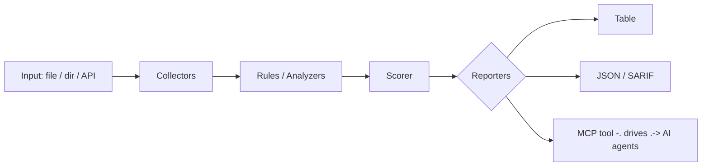

<a name="top"></a>
<div align="center">


# IOCEXTRACT

### Extract & defang IOCs (IPs/domains/hashes/URLs) from any text


[](#install--every-way-every-platform) [](https://github.com/cognis-digital/iocextract/actions) [](LICENSE) [](https://github.com/cognis-digital)

*Part of the Cognis Neural Suite.*

</div>

```bash
pip install "git+https://github.com/cognis-digital/iocextract.git"
iocextract scan .            # → prioritized findings in seconds
```

<!-- cognis:layman:start -->
## What is this?

When security analysts share threat reports, they often include indicators of compromise — things like IP addresses, domain names, URLs, file hashes, and email addresses that point to malicious activity. iocextract automatically pulls all of those indicators out of any blob of text in seconds, even when they have been deliberately obfuscated (like writing "hxxp" instead of "http" to make a link un-clickable). You paste in a threat report or point the tool at a file, and it hands you a clean, deduplicated list of every IP address, URL, domain, hash, CVE number, and more that it finds. It is aimed at security analysts, incident responders, and developers who need to feed those indicators into detection tools, SIEMs, or automated pipelines without manual copy-pasting.
<!-- cognis:layman:end -->

## Contents

- [Why iocextract?](#why) · [Features](#features) · [Quick start](#quick-start) · [Example](#example) · [Architecture](#architecture) · [AI stack](#ai-stack) · [How it compares](#how-it-compares) · [Integrations](#integrations) · [Install anywhere](#install-anywhere) · [Related](#related) · [Contributing](#contributing)

<a name="why"></a>
## Why iocextract?

feed-ready IOCs

`iocextract` is single-purpose, scriptable, and self-hostable: point it at a target, get prioritized results in the format your workflow already speaks (table · JSON · SARIF), gate CI on it, and let agents drive it over MCP.

<div align="right"><a href="#top">↑ back to top</a></div>

<a name="features"></a>
## Features

- ✅ Refang
- ✅ Defang
- ✅ Extract
- ✅ Extract From Files
- ✅ Runs on Linux/macOS/Windows · Docker · devcontainer
- ✅ Ports in Python, JavaScript, Go, and Rust (`ports/`)

<div align="right"><a href="#top">↑ back to top</a></div>

<a name="quick-start"></a>
<!-- cognis:install:start -->
## Install

`iocextract` is source-available (not published to PyPI) — every method below installs
straight from GitHub. Pick whichever you prefer; the one-line scripts auto-detect
the best tool available on your machine.

**One-liner (Linux / macOS):**
```sh
curl -fsSL https://raw.githubusercontent.com/cognis-digital/iocextract/HEAD/install.sh | sh
```

**One-liner (Windows PowerShell):**
```powershell
irm https://raw.githubusercontent.com/cognis-digital/iocextract/HEAD/install.ps1 | iex
```

**Or install manually — any one of:**
```sh
pipx install "git+https://github.com/cognis-digital/iocextract.git"     # isolated (recommended)
uv tool install "git+https://github.com/cognis-digital/iocextract.git"  # uv
pip install "git+https://github.com/cognis-digital/iocextract.git"      # pip
```

**From source:**
```sh
git clone https://github.com/cognis-digital/iocextract.git
cd iocextract && pip install .
```

Then run:
```sh
iocextract --help
```
<!-- cognis:install:end -->

## Quick start

```bash
pip install "git+https://github.com/cognis-digital/iocextract.git"
iocextract --version
iocextract scan .                       # scan current project
iocextract scan . --format json         # machine-readable
iocextract scan . --fail-on high        # CI gate (non-zero exit)
```

<div align="right"><a href="#top">↑ back to top</a></div>

<a name="example"></a>
## Example

```text
$ iocextract scan .
  [HIGH    ] IOC-001  example finding             (./src/app.py)
  [MEDIUM  ] IOC-002  another signal              (./config.yaml)

  2 findings · risk score 5 · 38ms
```

<div align="right"><a href="#top">↑ back to top</a></div>

<a name="architecture"></a>
## Architecture



<div align="right"><a href="#top">↑ back to top</a></div>

<a name="ai-stack"></a>
## Use it from any AI stack

`iocextract` is interoperable with every popular way of using AI:

- **MCP server** — `iocextract mcp` (Claude Desktop, Cursor, Cognis.Studio, [uncensored-fleet](https://github.com/cognis-digital/uncensored-fleet))
- **OpenAI-compatible / JSON** — pipe `iocextract scan . --format json` into any agent or LLM
- **LangChain · CrewAI · AutoGen · LlamaIndex** — wrap the CLI/JSON as a tool in one line
- **CI / scripts** — exit codes + SARIF for non-AI pipelines

<div align="right"><a href="#top">↑ back to top</a></div>

<a name="how-it-compares"></a>
## How it compares

| | **Cognis iocextract** | iocextract |
|---|:---:|:---:|
| Self-hostable, no account | ✅ | varies |
| Single command, zero config | ✅ | ⚠️ |
| JSON + SARIF for CI | ✅ | varies |
| MCP-native (AI agents) | ✅ | ❌ |
| Polyglot ports (JS/Go/Rust) | ✅ | ❌ |
| Open license | ✅ COCL | varies |

*Built in the spirit of **iocextract**, re-framed the Cognis way. Missing a credit? Open a PR.*

<div align="right"><a href="#top">↑ back to top</a></div>

<a name="integrations"></a>
## Integrations

Pipes into your stack: **SARIF** for code-scanning, **JSON** for anything, an **MCP server** (`iocextract mcp`) for AI agents, and a webhook forwarder for SIEM/Slack/Jira. See [`docs/INTEGRATIONS.md`](docs/INTEGRATIONS.md).

<div align="right"><a href="#top">↑ back to top</a></div>

<a name="install-anywhere"></a>
## Install — every way, every platform

```bash
pip install "git+https://github.com/cognis-digital/iocextract.git"    # pip (works today)
pipx install "git+https://github.com/cognis-digital/iocextract.git"   # isolated CLI
uv tool install "git+https://github.com/cognis-digital/iocextract.git" # uv
pip install cognis-iocextract                                          # PyPI (when published)
docker run --rm ghcr.io/cognis-digital/iocextract:latest --help        # Docker
brew install cognis-digital/tap/iocextract                             # Homebrew tap
curl -fsSL https://raw.githubusercontent.com/cognis-digital/iocextract/main/install.sh | sh
```

| Linux | macOS | Windows | Docker | Cloud |
|---|---|---|---|---|
| `scripts/setup-linux.sh` | `scripts/setup-macos.sh` | `scripts/setup-windows.ps1` | `docker run ghcr.io/cognis-digital/iocextract` | [DEPLOY.md](docs/DEPLOY.md) (AWS/Azure/GCP/k8s) |

<div align="right"><a href="#top">↑ back to top</a></div>

<a name="related"></a>
<a name="verification"></a>
## Verification

[](AUDIT.md)

Every push is verified end-to-end. Latest audit (2026-06-12):

```text
tests        : 54 passed, 0 failed, 0 errored
compile      : all modules parse
cli          : C:\Python314\python.exe: No module named https
package      : https
```

<details><summary>CLI surface (<code>--help</code>)</summary>

```text
C:\Python314\python.exe: No module named https
```
</details>

Full machine-readable results: [`AUDIT.md`](AUDIT.md) · regenerate with `python -m https --help` + `pytest -q`.

<div align="right"><a href="#top">↑ back to top</a></div>


## Related Cognis tools

- [`portfan`](https://github.com/cognis-digital/portfan) — Summarize and diff nmap XML into prioritized, attackable findings
- [`subhunt`](https://github.com/cognis-digital/subhunt) — Aggregate & dedupe subdomain enumeration from multiple sources
- [`dirsight`](https://github.com/cognis-digital/dirsight) — Analyze web content-discovery output (ffuf/gobuster) into ranked endpoints
- [`jwtinspect`](https://github.com/cognis-digital/jwtinspect) — Decode JWTs and lint for alg=none, weak secrets, and missing claims
- [`corsaudit`](https://github.com/cognis-digital/corsaudit) — Detect permissive/misconfigured CORS from headers or a config
- [`headerscan`](https://github.com/cognis-digital/headerscan) — Grade HTTP security headers (CSP/HSTS/XFO) A-F from a response dump

**Explore the suite →** [🗂️ all 170+ tools](https://github.com/cognis-digital/cognis-neural-suite) · [⭐ awesome-cognis](https://github.com/cognis-digital/awesome-cognis) · [🔗 cognis-sources](https://github.com/cognis-digital/cognis-sources) · [🤖 uncensored-fleet](https://github.com/cognis-digital/uncensored-fleet) · [🧠 engram](https://github.com/cognis-digital/engram)

<div align="right"><a href="#top">↑ back to top</a></div>

<a name="contributing"></a>
## Contributing

PRs, new rules, and demo scenarios are welcome under the collaboration-pull model — see [CONTRIBUTING.md](CONTRIBUTING.md) and [SECURITY.md](SECURITY.md).

> ### ⭐ If `iocextract` saved you time, **star it** — it genuinely helps others find it.

## License

Source-available under the **Cognis Open Collaboration License (COCL) v1.0** — free for personal, internal-evaluation, research, and educational use; **commercial / production use requires a license** (licensing@cognis.digital). See [LICENSE](LICENSE).

---

<div align="center"><sub><b><a href="https://cognis.digital">Cognis Digital</a></b> · one of 170+ tools in the <a href="https://github.com/cognis-digital/cognis-neural-suite">Cognis Neural Suite</a> · <i>Making Tomorrow Better Today</i></sub></div>
